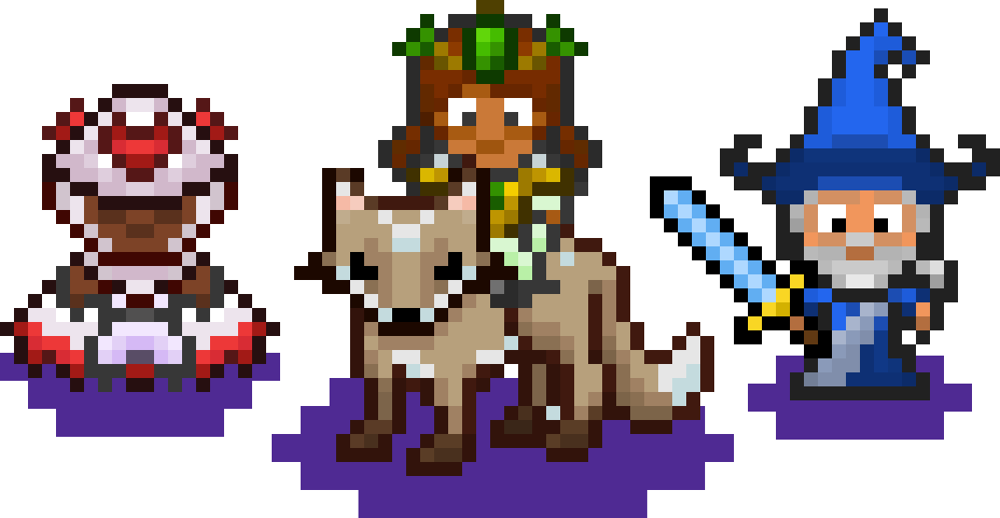

# Projeto MultichatHabitica

Sistema utilizando conceito de WebSockets Do NodeJs para gerar um chat web para poder
falar com meus amigos do <a href='https://habitica.com/'>Habitica</a>.

Sistema Segue o padrão MVC e possui um codigo limpo.

Em breve melhorias no sistema.
